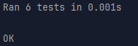

# Домашнее задание №3 по дисциплине "Конфигурационное управление"

## Задание 3. Вариант 3

---

Разработать инструмент командной строки для учебного конфигурационного языка, синтаксис которого приведен далее. 
Этот инструмент преобразует текст из входного формата в выходной. Синтаксические ошибки выявляются с выдачей сообщений.
Входной текст на языке toml принимается из файла, путь к которому задан ключом командной строки. 
Выходной текст на учебном конфигурационном языке попадает в файл, путь к которому задан ключом командной строки.

Многострочные комментарии:
{{! Это многострочный комментарий }}

Массивы: (list значение значение значение ... )

Словари: table([ имя = значение, имя = значение, имя = значение, ... ])

Имена:
[_A-Z][_a-zA-Z0-9]*

Значения:
- Числа.
- Массивы.
- Словари.

Объявление константы на этапе трансляции:
имя: значение
Вычисление константного выражения на этапе трансляции (инфиксная форма), пример:

|имя + 1|

Результатом вычисления константного выражения является значение.
Для константных вычислений определены операции и функции:
1. Сложение.
2. Вычитание.
3. Умножение.
4. Деление.
5. min().

Все конструкции учебного конфигурационного языка (с учетом их возможной вложенности) должны быть покрыты тестами. Необходимо показать 3 примера описания конфигураций из разных предметных областей.

---

# Конвертер TOML в учебный конфигурационный язык

## Описание

Данный проект представляет собой утилиту для преобразования файлов в формате TOML в специфический формат конфигурационного языка. 
Основные возможности:
- Удаление многострочных комментариев в формате `{{! ... }}`.
- Валидация имен переменных и ключей.
- Обработка массивов, словарей и выражений.
- Вычисление арифметических операций в инфиксной нотации.
- Поддержка пользовательских комментариев в выходных данных.

---

## Функциональность

### Поддерживаемые типы данных
- **Числовые значения**: сохраняются и могут использоваться в выражениях.
- **Массивы**: преобразуются в вид `(list ...)`.
- **Словари**: преобразуются в вид `table([...])`.
- **Арифметические выражения**: поддерживаются операции `+`, `-`, `*`, `/`, `min`.

---

## Использование  

### Команда для запуска
```bash

python main.py input.toml output.txt
```

### Пример TOML файла

```toml
{{!
comment
comment
}}

Constant1 = 100
Constant2 = 25

Values = [1, 2, 3, 4]

Expr1 = "|Constant1 Constant2 +|"
Expr2 = "|Constant1 Constant2 -|"
Expr3 = "|Constant1 2 *|"
Expr4 = "|Constant1 5 /|"
Expr5 = "|Constant1 Constant2 min|"

["Dict"]
Key1 = 10
Key2 = 20
```

### Пример вывода

```
100 -> Constant1   {! {{! comment comment }} !}
25 -> Constant2
(list 1 2 3 4) -> Values
125 -> Constant1 Constant2 +
75 -> Constant1 Constant2 -
200 -> Constant1 2 *
20.0 -> Constant1 5 /
25 -> Constant1 Constant2 min
table([
Key1 = 10, 
Key2 = 20
]) -> Dict
```
---

## Тестирование

### Результаты тестирования 



### Запуск тестов

```bash

python -m unittest main_test.py   
```
